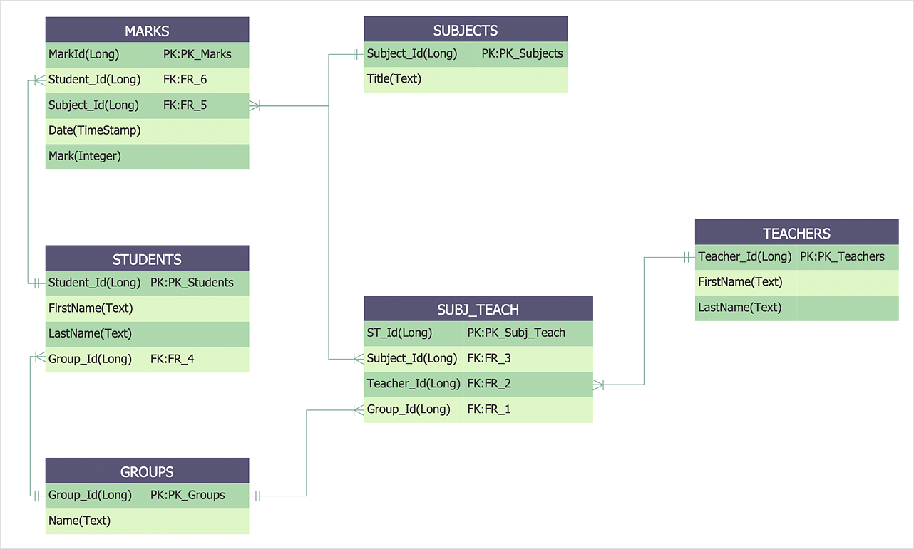

# Reading Material Databases Week 2

## Agenda

These are the topics for week 2:

1. What’s an identifier (keys)?
   - Primary key
   - Foreign key
   - Composite key
2. What are the 3 types of relationships?
   - One-to-One (1-1)
   - One-to-Many (1-M)
   - Many-to-Many (M-M)
3. What’s domain modeling?
   - Entity Relationship Diagram (ERD)
4. How to use SQL: joins, aggregate Functions, distinct, group by, having
   - Joins
   - Aggregate functions
   - Distinct
   - Group By
   - Having

## 0. Video Lectures

Your teachers Igor and Unmesh have made video lectures for this week's material. You can find them here: [Videos 9 - 10](https://www.youtube.com/playlist?list=PLVYDhqbgYpYVq-rHFB1x2-P7esnWotCB7)

<a href="https://www.youtube.com/playlist?list=PLVYDhqbgYpYVq-rHFB1x2-P7esnWotCB7" target="_blank"></a>

## 1. What’s an identifier (keys)?

A key or identifier is a single or combination of multiple fields in a table which is used to fetch or retrieve records/data-rows from data table according to the condition/requirement.

Keys are also used to create a relationship among different database tables or views.

### Primary Key

The PRIMARY KEY constraint uniquely identifies each record in a table.
Primary keys must contain UNIQUE values, and cannot contain NULL values.
A table can have only ONE primary key; and in the table, this primary key can consist of single or multiple
columns (fields).

To define a Primary Key while creating the table, you should determine the attribute in Column definition part:

```sql
CREATE TABLE teachers (
      teacher_number INT,
      teacher_name VARCHAR(50),
      date_of_birth DATE,
      subject TEXT,
      gender ENUM('m', 'f'),
      CONSTRAINT PK_Teacher PRIMARY KEY (teacher_number)
);
```

If you already have the table, and you just want to change a column to Primary Key:

```sql
ALTER TABLE teachers ADD PRIMARY KEY (teacher_number);
```

or you can define a primary key later:

```sql
ALTER TABLE teachers ADD CONSTRAINT PK_Person PRIMARY KEY (ID,LastName);
```

### Foreign Key

A FOREIGN KEY is a key used to link two tables together. This KEY is a field
(or collection of fields) in one table that refers to the PRIMARY KEY in another table.

To define a Foreign Key while creating the table, you can use the below query:

```sql
CREATE TABLE students (
    student_number int,
    student_name VARCHAR(50),
    gender ENUM('m', 'f'),
    PRIMARY KEY (student_number),
    CONSTRAINT FK_TEACHER FOREIGN KEY (teacher_id) REFERENCES teachers(teacher_number)
);
```

or you can add a foreign key later:

```sql
ALTER TABLE students
    ADD CONSTRAINT FK_TEACHER FOREIGN KEY (teacher_id) REFERENCES teachers(teacher_number);
```

### Composite Key

A composite key is a key composed of two or more columns in a table that can be used to uniquely identify
each row in the table when the columns are combined **uniqueness is guaranteed**, but when it taken individually
it does not guarantee uniqueness.

```sql
CREATE TABLE students
    student_number int,
    student_name VARCHAR(50),
    gender ENUM('m', 'f'),
    PRIMARY KEY (student_number, student_name));
```

For more information, check out the following:

- [Linked Tables and keys](https://www.youtube.com/watch?v=ia4eCxPPc_o)

## 2. What are the 3 types of relationships?

There are three specific types of relationships that can exist between a pair of tables:
one-to-one, one-to-many, and many-to-many. The tables participate in only one type of
relationship at any given time. (You'll rarely need to change the type of relationship
between a pair of tables. Only major changes in either of the table's structures could
cause you to change the relationship.)

### One-to-One (1-1)

A pair of tables bears a one-to-one relationship when a single record in the first table is
related to only one record in the second table, and a single record in the second table is
related to only one record in the first table. To implement this relationship, we should
put a foreign key in One side that is referring to another One side.

For example, each teacher has a specific compensation for himself (Not more than one as a teacher)
and each compensation only belongs to one (and just one) teacher. So there is a One-to_one
relationship between entity teacher and entity compensation.

### Many-to-One (1-M)

A one-to-many relationship exists between two tables when a single record in the
first table can be related to **one or more** records in the second table, but a single record
in the second table can be related to only one record in the first table. To implement this
relationship, we should put a foreign key in Many side that is referring to One side.

For example, each teacher can teach to some (zero to several) students, but in reverse direction
each student in one time has just one teacher. So there is a Many-to-One relationship
between entity student and entity teacher.

### Many-to-Many (M-M)

A pair of tables bears a many-to-many relationship when a single record in the first table
can be related to one or more records in the second table and a single record in the second
table can be related to one or more records in the first table. We will see how to implement
this relationship in week 3.

To learn more about relationships, check out the following:

- [Defining table relationships](https://www.youtube.com/watch?v=V5DyvUfsboA)
- [Relational Database concepts](https://www.youtube.com/watch?v=NvrpuBAMddw)

## 3. What’s domain modeling?

Domain Modeling is a way to describe and model real world entities and the relationships between them, which collectively describe the problem domain space.

Derived from an understanding of system-level requirements, identifying domain entities and their relationships provides an effective basis for understanding and helps practitioners design systems for maintainability testability, and incremental development.

### Entity Relationship Diagram (ERD)

Entity Relationship Diagrams (ERD) are used widely in domain modeling. In this diagram, **entities** are showing by boxes and are connected to each other with a line (**relationships**).

An example of ER diagrams are shown below:



To learn more about this topic, check out the following:

- [The Domain Model](https://www.youtube.com/watch?v=acQxZ80Lt10)
- [Entity Relationship Diagram Training Video](https://www.youtube.com/watch?v=-fQ-bRllhXc)
- [Entity-Relationship Diagrams](https://www.youtube.com/watch?v=c0_9Y8QAstg)

## 4. How to use SQL: joins, group by, having

### Joins

#### Inner Joins

Let’s say we wanted to get a list of those students and the details of their teacher. This would be a perfect fit for an inner join, since an inner join returns records at the intersection of the two tables.

```sql
SELECT students.first_name, students.last_name, students.gender, students.grade, teachers.full_name
FROM students
INNER JOIN teachers
ON students.teacher_number = teachers.teacher_number
```

When you join two tables there can be columns in both tables with the same name.
To be explicit about the column you need you have to prefix the column with the table name like `table.column`
If you want to type less you can create an alias for table names using `table as alias` or `table alias` leaving out `AS`

```sql
SELECT teachers.*, tq.title
FROM teachers
JOIN teacher_qualifications as `tq` ON tq.teacher_id = teacher.id
```

#### Right and Left Joins

If we wanted to simply append information about teachers to our students table regardless of whether a student has a teacher or not, we would use a left join. A left join returns all records from table A and any matching records from table B.

```sql
SELECT students.first_name, students.last_name, teachers.full_name
FROM students
LEFT JOIN teachers ON students.teacher_number = teachers.number
```

If you tried to keep all the teachers and wanted to see teachers with or without students you need a right join.
The right join will keep all records from the joined table and discard records, from the preceding tables, that can't be joined

Check out the following to get a more visual idea of what `joins` are:

- [Understand SQL Joins in 10 Minutes](https://www.youtube.com/watch?v=tvMGoxmQzgQ)
- [Joins in SQL](https://www.youtube.com/watch?v=efpFCd8iFAQ)

### Aggregate Functions in SQL

In database management an **Aggregate Function** is a function where the values of multiple rows are grouped together as input on certain criteria to form a single value of more significant meaning.

- `COUNT()`
- `SUM()`
- `AVG()`
- `MIN()`
- `MAX()`

### Distinct Keyword

DISTINCT statement is used to return only distinct (different) values. It can be used with aggregation functions. In below example, we retrieve the numbers of teachers from students table.

```sql
SELECT COUNT(DISTINCT teacher_number) AS no_teachers
FROM students
```

### Group By

The **GROUP BY** statement groups rows that have the same values into summary rows, like "find the number of students for each teacher".

The **GROUP BY** statement is often used with aggregate functions to group the result-set by one or more columns.

```sql
SELECT COUNT(techer_number) AS no_teachers, techer_number AS teacher_number
FROM students
GROUP BY teacher_number
```

### Having

The **Having** clause makes the aggregate functions conditional. It restricts the query results of _group by_ clause.

For example in below example, we just retrieve the teachers who teach more that three students.

```sql
SELECT COUNT(techer_number) AS no_teachers, techer_number AS teacher_number
FROM students
GROUP BY teacher_number
HAVING COUNT(teacher_number) > 3
```

## Finished?

Are you finished with going through the materials? High five! If you feel ready to get practical, click [here](./MAKEME.md).
