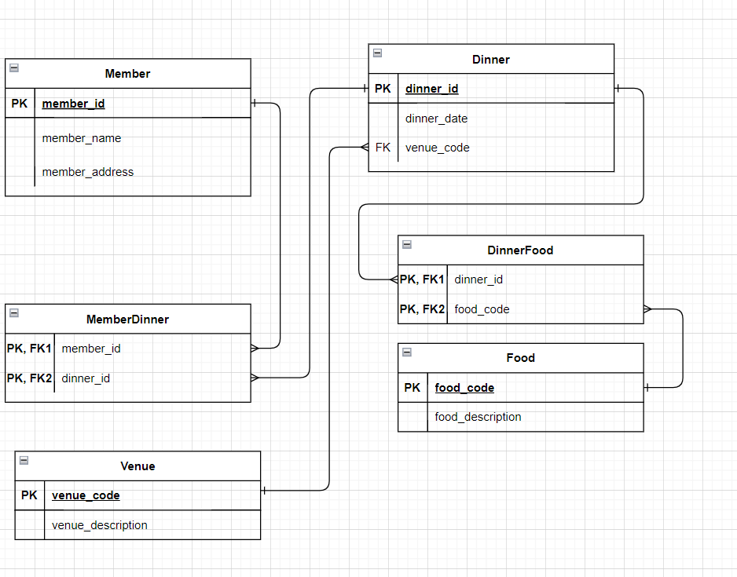

## 1. What columns violate 1NF?
- columns `food_code` and `food_description`. They contain multiple values, which violates atomic value rule of 1NF
## 2. What entities do you recognize that could be extracted?
- member
- dinner
- venue
- food
- dinner_food

## 3. Name all the tables and columns that would make a 3NF compliant solution.
- member
- dinner
- venue
- food
- dinner_food
- member_dinner
